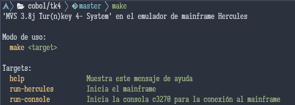

# El sistema `MVS 3.8j Tur(n)key 4-` en el emulador de mainframe Hercules

Este repositorio contiene una copia del sistema Operativo `MVS 3.8j Tur(n)key 4-` funcionando sobre el emulador de mainframe Hercules, listo para usar.
Además del codigo fuente y un binario para linux del terminal open source 3270.

Este repositorio se creó con el fin de tener un acceso a este sistema operativo debido a que la página donde se conseguía se
encuentra caída (<http://wotho.ethz.ch/tk4-/>).

En teoría, este proyecto funciona tanto para Linux como para Windows y MacOS, la información acá relacionada es para un sistema
Linux (Más específicamente la distribución Archlinux actualizada a Diciembre de 2023). Si alguien quiere realizar pruebas en otra
distribución o Sistema Operativo, no dude en contactar conmigo sus resultados para ir complementando este repositorio al correo
**wfabianrs@gmail.com**.

Conforme siga practicando con este proyecto iré actualizando la documentación.

## Uso

El proyecto contiene un pequeño Makefile desde el cual puede iniciar el Sistema Operativo:

Este archivo se puede personalizar para ajustarse a solicitud de quien lo requiera.

Se necesita un _terminal 3270_ para conectarte a tu instancia local al puerto **3270**, por ejemplo el terminal _c3270_ incluido en el repositorio o
compilar la versión más cómoda a usar. También puede utilizar su navegador web para conectarse a la página de la consola web
escribiendo `http://localhost:8038/`
